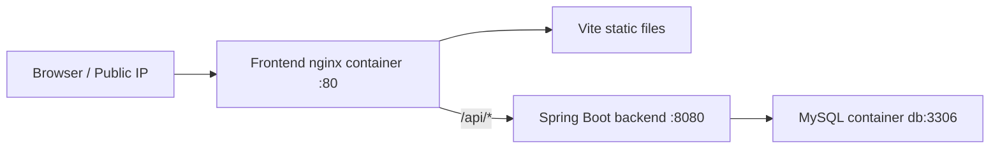
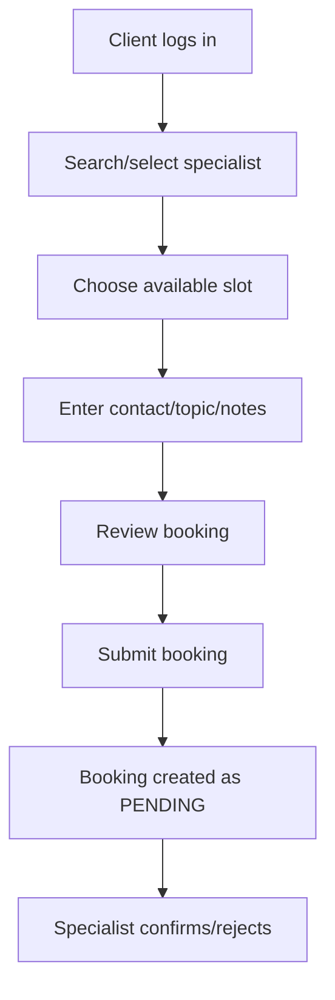

# Presentation Follow-Up Q&A

This document prepares short answers for likely follow-up questions after demoing the current project status.

## Current System Snapshot



- Frontend: Vite static app served by nginx.
- Backend: Spring Boot REST API.
- Database: MySQL 8 in Docker Compose.
- Deployment target: Aliyun Docker Compose.
- Main access URL: `http://<public-ip>/#/login`.

## Docker and Deployment

### Q: Why did the frontend load but API/login returned 404 before?

- The frontend container was not using the custom `nginx.conf`.
- Static files could be served, but `/api/...` was not proxied to the backend.
- The fix was to copy `nginx.conf` into `/etc/nginx/conf.d/default.conf` in `Dockerfile.frontend.local`.

### Q: Why is `backend:8080` used in nginx instead of the public IP?

- Inside Docker Compose, services communicate through service names.
- `backend` is the Compose service name.
- `localhost` inside the frontend container would point to the frontend container itself, not the backend.

### Q: What does the request path look like in production?

```text
Browser
  -> http://<public-ip>/api/auth/login
  -> nginx frontend container
  -> http://backend:8080/api/auth/login
  -> Spring Boot AuthController
```

### Q: Does the backend connect to MySQL through localhost?

- No, not in Docker/prod.
- Docker uses:

```properties
SPRING_DATASOURCE_URL=jdbc:mysql://db:3306/consult_db...
```

- `db` is the Compose service name for MySQL.

### Q: Why can local backend startup behave differently from Docker?

- Docker activates the `prod` Spring profile through `.env`.
- Local `mvnw spring-boot:run` uses the default profile unless explicitly configured.
- Root `.env` is loaded by Docker Compose, not automatically by local Maven runs.

## Feature Demo Questions

### Q: What is the booking flow?



### Q: What booking bug was fixed?

- The frontend sent a single field:

```js
slotId
```

- The backend expected:

```java
List<Long> slotIds
```

- Because of this mismatch, backend validation said the slot list was empty.
- The frontend now sends:

```js
slotIds: [selectedSlot.slotId ?? selectedSlot.id]
```

### Q: Why does the backend use `slotIds` instead of `slotId`?

- The backend design supports booking one or more slots.
- The current UI selects one slot, so it sends a one-item array.
- This keeps the frontend compatible with the backend contract.

### Q: What happens after booking is submitted?

- Backend validates the user is a client.
- Backend checks the selected slot exists and is available.
- Backend creates a booking with `PENDING` status.
- Backend marks the slot as unavailable.
- Specialist can later confirm or reject the booking.

## Error Handling

### Q: Why did the UI show a Chinese error message like "cannot be empty"?

- The backend was returning default Jakarta Validation messages.
- Those messages can be localized by the runtime environment.
- The specific booking error was caused by the wrong request field, not by the user leaving the form empty.

### Q: Is changing global validation messages required?

- Not required for the booking bug.
- Recommended later for consistent English UX.
- A future improvement would be to map validation errors to English messages in `GlobalExceptionHandler`.

### Q: How should we answer if asked why this was not changed yet?

- The critical functional bug was fixed first.
- Global validation wording affects all forms, so it should be changed carefully and tested across login, register, booking, reviews, categories, and profile forms.
- Current priority was restoring correct booking submission.

## Security and CORS

### Q: Why is CORS configured?

- It controls which browser origins may call the backend directly.
- In the Docker deployment, normal frontend API calls go through nginx as same-origin `/api/...` requests.
- CORS is still useful if the backend is accessed directly on port `8080`.

### Q: What should production CORS include?

- At minimum:

```env
APP_CORS_ALLOWED_ORIGINS=http://<public-ip>
```

- If users access other exact origins, add them explicitly:

```env
http://<public-ip>:80
http://<public-ip>:8080
https://<domain>
```

### Q: Is exposing backend port `8080` necessary?

- Not strictly necessary if all API traffic goes through nginx.
- It can be useful for debugging.
- For stricter production deployment, port `8080` could be removed from public exposure and kept internal to Docker.

## Database

### Q: How is MySQL initialized?

- Docker Compose starts a MySQL 8 container.
- Database name, user, and password come from `.env`.
- Spring JPA uses `ddl-auto=update`, so schema changes are applied automatically at startup.

### Q: What is one possible database deployment risk?

- If the `mysql_data` volume already exists, changing `.env` credentials does not recreate MySQL users.
- Existing volumes preserve old database state.
- If credentials change after first deployment, the volume may need manual user updates or a clean reset.

### Q: Why does backend wait for DB health?

- `depends_on` waits for the MySQL service to become healthy.
- This reduces startup race conditions where backend starts before MySQL accepts connections.

## Known Limitations and Future Work

### Q: What are current limitations?

- Validation messages are not yet fully normalized to English.
- Backend port `8080` is publicly mapped, which may not be ideal for final production.
- Deployment uses `ddl-auto=update`, which is convenient for demo but less controlled than migrations.
- Upload volume is declared but backend upload path should be reviewed if file upload is part of the demo.

### Q: What would you improve next?

- Add English validation message mapping for all form errors.
- Add backend integration tests for booking creation.
- Add frontend error handling that displays field-specific messages.
- Add database migration tooling such as Flyway or Liquibase.
- Restrict backend access so public traffic only enters through nginx.

### Q: Is the current project ready for demo?

- Yes, for the core flow:
  - user login
  - specialist browsing
  - slot selection
  - booking submission
  - backend/database persistence
- Demo should use:

```text
http://<public-ip>/#/login
```

- Before demo, run:

```bash
docker compose down
docker compose up -d --build
docker compose logs backend
docker compose logs frontend
```

## Quick Troubleshooting Answers

### Q: Login page is 404. What should we check?

- Use `/#/login`, not `/login`.
- Check frontend nginx config inside the container:

```bash
docker compose exec frontend cat /etc/nginx/conf.d/default.conf
```

### Q: Login API is 404. What should we check?

- Confirm `/api/` proxy exists in nginx.
- Confirm backend container is running.
- Confirm frontend image was rebuilt after Dockerfile changes.

### Q: Booking says required field is empty. What should we check?

- Check browser network request body.
- It must contain:

```json
{
  "slotIds": [1],
  "contact": "user@example.com"
}
```

- It should not send only `slotId`.

### Q: Backend cannot connect to DB in Docker. What should we check?

- `SPRING_PROFILES_ACTIVE=prod`
- `SPRING_DATASOURCE_URL=jdbc:mysql://db:3306/consult_db...`
- MySQL container health status
- Existing `mysql_data` volume credentials

## Short Closing Statement

- The current system is a three-container Docker Compose deployment.
- The frontend is served by nginx and proxies API calls to the backend.
- The backend persists booking data in MySQL.
- Recent fixes focused on deployment correctness and booking request compatibility.
